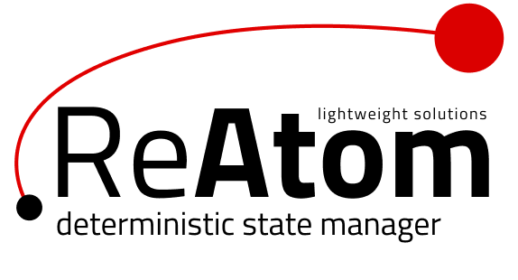

 

 
 

ReAtom is **declarative** and **reactive** state manager, designed for both simple and complex applications.

> **IMPORTANT!** Current state is **Work In Progress**. We do not recommend to use in production at the moment, but... We look forward to your feedback and suggestions to improve the API

## Packages
| Package | Version | Size
--------|---------|----
| [`@reatom/core`](packages/core) |  | 
| [`@reatom/react`](packages/react) |  | 

## Goals and features

- 🐣 **simple abstraction** and friendly DX: minimum boilerplate and tiny API
- ❗️ **static typed**: best type inference
- ⚡ **performance**: light tiny updates in huge state
- 🗜 **small size**: [2 KB](https://bundlephobia.com/result?p=@reatom/core) gzipped
- 📦 **modular**: reusable instances (SSR)
- 🍴 **lazy**: solution for code splitting out of the box
- 🧪 **testing**: simple mocking
- 🛠 **debugging**: immutable data, devtools (redux ecosystem support by adapter)
- 🔮 **deterministic**: declarative and predictable specification of state shape and its mutations
- 👴 **ES5 support** (by polyfills)
- synchronous [glitch](https://stackoverflow.com/questions/25139257/terminology-what-is-a-glitch-in-functional-reactive-programming-rx) free: resolve [diamond problem](https://github.com/artalar/reatom/blob/master/src/__tests__/diamond.ts)
- simple integration with other libraries (Observable, redux ecosystem, etc)
- awkward for write bad code
- handy for write good code

## Description

> Inspired by [redux](https://github.com/reduxjs/redux), [kefir](https://github.com/kefirjs/kefir), [effector](https://github.com/zerobias/effector)

**REAtom** is a blend of the one-way data flow (by [flux](https://github.com/facebook/flux) and global store) and decentralized [atoms](https://github.com/calmm-js/kefir.atom/blob/master/README.md#related-work) for [deterministic](https://en.wikipedia.org/wiki/Deterministic_algorithm) and flexible description of state and its changes.

## Motivation

<!--

### State management Zen

// https://en.wikipedia.org/wiki/Zen_of_Python

Guiding principles of state manager:

- The model of state must be determined
- The changes of state must be determined

-->

### Why not [redux](https://github.com/reduxjs/redux)

- Selectors are not inspectable (is lacking in devtools).
- Difficult static type inference (because every selector must to know full path to parent state).
- Hard for modular architecture (because every selector must to know about parent state).
- Separation of interfaces, to reducers and selectors, complicating build separated domains.
- Selectors - is **manual** API to state. It must be **manualy** described and memorized.
- Selectors execute after state change at subscriptions - error in selector will throw error and is no possibility (ok, all possible, but it is really hard) to restore previous valid state.
- classic reducer API is had much boilerplate and [static] type description boilerplate.
- Selectors "runtime" oriented, mean if some "feature" use any part of state (by selector) when you will remove that part, you get the error only when you will try to mount your "feature" at runtime (if you have not static typing). One of the solutions - is connect all features statically by imports.
- Middleware - is confound pattern that, sometimes unexpected, modify the behavior of store. Reference example: actions for redux-thunk don't logged.
  <!-- - Memorized selectors is extra computations by default, but it is defenetly unnecessary in SSR -->
  > A part of problems solves by various fabric functions, but without standardization it is harmful.

### Why not [effector](https://github.com/zerobias/effector)

- Effector is about _atomic **stores**_ - it statefull approach with problems:
  - probable [memory leaks](https://youtu.be/fbtElWjOXV0?t=1432)
  - difficult [store] instance reusability (for example, concurrences problems with SSR)
    > It can be solved, but better way solve it by design of library architecture and API
- Asynchronous and probably cyclic dependencies specification
- The [weight](https://bundlephobia.com/result?p=effector@20.1.2) can be smaller
  > The part of API is treeshakable
- [Throw in reducer is not cancel computation of other reducers](https://github.com/zerobias/effector/issues/90)
- Effector's stores is not lazy: if store haven't subscribers it will recalculate at each depended update anyway.

### Why not [MobX](https://github.com/mobxjs/mobx)

- Huge bundle size, unstandardized foreground syntax (decorators), ES5 limitations
- Doesn't move to separate _model_ and _view_.
- Runtime semantic and mutable state (is not a better way for debugging).
- [Proxy pattern](https://en.wikipedia.org/wiki/Proxy_pattern) is lack of visual part of code semantic.
- Is not simple under the hood and it need to consider when choose algorithms for word with data-structure
- [And others...](https://mobx.js.org/best/pitfalls.html)

---

Next:

> - <a href="https://artalar.github.io/reatom/#/glossary">Glossary</a>
> - <a href="https://artalar.github.io/reatom/#/examples">Examples</a>
> - <a href="https://artalar.github.io/reatom/#/faq">FAQ</a>
