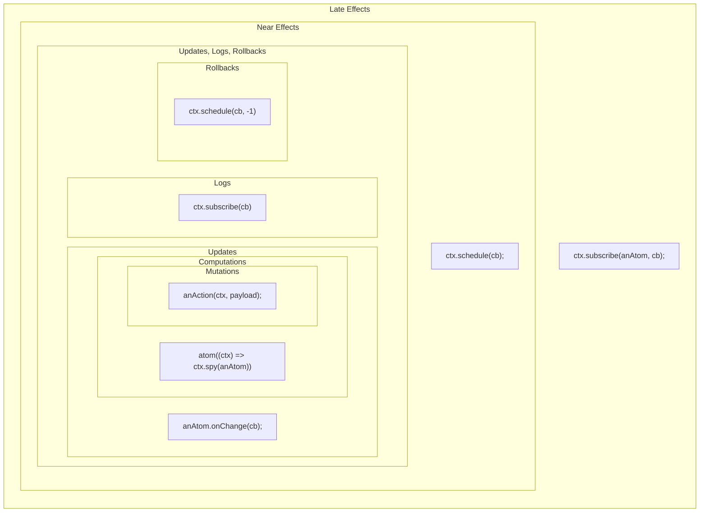

Welcome to the awesome world of the Reatom library! 🤗

This powerful tool is designed to become your go-to resource for building anything from tiny libraries to full-blown applications.

We know the drill: usually, you'd have to keep reinventing the wheel with high-level patterns or depend on external libraries.
Both are tough to balance perfectly for interface equality, semantic compatibility, performance, ACID principles, debugging, logging, test setup, and mocking.

To make life easier, we've crafted the perfect building blocks (`atom` and `action`) and a bunch of packages on top of them.
These tools tackle the tough stuff so you can focus on being creative.

This guide will walk you through all the features of Reatom, including the core concepts, mental model, ecosystem, and infrastructure.

## TL;DR

Need a quick start? Here is a list of the key topics:

- [@reatom/core](/package/core/): provides basic primitives to build anything. Store your state in an `atom` and your logic in an `action`.
- **Immutable Data**: just like in React or Redux, all data changes should be immutable.
- `ctx`: this is essential for better debugging, simple testing, and SSR setup.
- [@reatom/async](/package/async/): will help you to handle network state smoothly.
- **Helpful Packages**: check out the **Packages** section in the sidebar for more useful tools.
- [@reatom/eslint-plugin](/package/eslint-plugin/): automatically adds debug names to your code, and [@reatom/logger](/package/logger/) prints helpful logs to your console.
- [Template repo](https://github.com/artalar/reatom-react-ts): will help you to get started quickly

## Installation

The [core](/package/core/) package is packed with features and has a great architecture.
You can use it as is for small apps or build your own framework on top of it for larger projects.

For your convenience, we've created a [framework](/package/framework/) package suitable for most apps and developers.
Basically, it's a collection of the most useful packages reexported, simplifying Reatom's use and maintenance.
It shortens imports and direct dependencies, making updates easier.

Tree shaking works just fine, so don't worry about the bundle size.
Reatom development is highly focused on efficiency in this aspect.

This guide will walk you through all the main features, including installing infrastructure packages like [testing](/package/testing/) and [eslint-plugin](/package/eslint-plugin/).
The [logger](/package/logger/) package is already included in the framework, so no extra installation is needed.

The final piece of the installation script depends on your stack.

Most likely you will need [@reatom/npm-react](/package/npm-react/) adapter package, but we also have adapters for other view frameworks.

> The "npm-" prefix in adapter packages prevents naming collisions with ecosystem packages, as the NPM global namespace is widely used, and many common words are already taken.

```sh
npm i @reatom/framework @reatom/testing @reatom/eslint-plugin @reatom/npm-react
```

A note about the ecosystem: all packages that start with "@reatom/" are built and maintained in [the monorepo](https://github.com/artalar/reatom).

This approach allows us to control compatibility and stability precisely, even with minor releases.
If you want to contribute a new package, feel free to follow [the contributing guide](/contributing/).

We have a `package-generator` script that will bootstrap a template for a new package.
All we need from you are the source code, tests, and documentation 😉

## Reactivity

Let's write some simple form code and make it reactive to boost scalability, debuggability, and testability.

We're using a separate state manager for this form as an example to show how it works.
The benefits will get bigger as your real application grows.

```html
<input id="NAME" />
<p id="GREETING"></p>
```

Note, that all HTML elements with IDs stored in the global namespace with relative names.

```ts
export let name = localStorage.getItem('name') ?? ''
const updateName = (newName) => {
  name = newName
  localStorage.setItem('input', name)
  greeting = `Hello, ${name}!`
}

export let greeting = ''

// view bindings
NAME.value = name
NAME.oninput = (event) => {
  updateName(event.target.value)
  GREETING.innerText = greeting
}
greeting = `Hello, ${name}!`
GREETING.innerText = greeting
```

So, the code above is pretty straightforward, isn't it?
However, it's already messy and has some unexpected bugs.

**The first** obvious issue is code duplication.
We repeat `Hello...` and assign `innerText` twice, and this can't be fixed easily.
Moving it to a separate function might help, but you'll still need to call that function twice: once for initialization and once for updating.

**The second** significant issue is code coupling.
In the code above, the update logic for the greeting is in the name update handler, but the actual data flow is inverse: the greeting depends on the name.
While this might seem trivial in a small example, it can lead to confusion in real applications with complex code organization and business requirements.
You might lose track of why one part of the code changes another.

Once again, we are investigating a super simple example because it's short and obvious. In this particular example there is no much sense to refactor anything, but it needed to illustrate the problems in general. That problems becomes fall your code base to a pit of failure during a time and have a huge impact in general, so it is important to find a pattern to reduce those problems as much as possible. So, it is **the main reason for reactivity: solve state SSoT and a code coupling**.

Reactive programming can address these issues by accurately describing dependent computations within each domain.

Let's refactor the code using Reatom.

We use the `atom` function to wrap our changeable data:

- If you pass a primitive value to the atom, it allows the state to change.
- If you pass a `computer` function to the atom, it creates a read-only atom that automatically recomputes when dependent atoms change, but only if the computed atom has a subscription.

```ts
export const nameAtom = atom(localStorage.getItem('name') ?? '', 'nameAtom')
nameAtom.onChange((ctx, name) => {
  localStorage.setItem('input', name)
})

export const greetingAtom = atom((ctx) => {
  const name = ctx.spy(nameAtom)
  return `Hello, ${name}!`
}, 'greetingAtom')

// view bindings
NAME.value = ctx.get(nameAtom)
NAME.oninput = (event) => {
  nameAtom(ctx, event.target.value)
}
ctx.subscribe(greetingAtom, (greeting) => {
  GREETING.innerText = greeting
})
```

Now, we have the same amount of code, but it is much better organized and structured.
Plus, we have `ctx`!

This context object provides powerful capabilities for debugging, testing, and many other useful features. Note? that the string names in the second `atom` parameters are optional and used for debugging.
We'll explore these advantages in more detail later.

## Data consistency

Data consistency is a critical challenge that can be difficult to manage and debug.

For instance, if your code runs in an environment that heavily uses a storage (`localStorage`, for example), you might encounter a quota error when setting new data.
In such cases, users will see their input changes, but the greeting updates won't occur.
Although wrapping storage processing code in a `try-catch` block can handle this, many developers consider these errors too rare to address in practice.
It would be great to solve these problems elegantly with a consistent pattern.

Reatom provides excellent features for maintaining data consistency.
All data processing is accumulated and saved in the internal store only after completion.
If an error occurs, like "Cannot read property of undefined," all changes are discarded.
This mechanism is similar to how React handles errors during the rendering process or how Redux handles errors in reducers.

> This concept comes from database theory and is [part of the ACID principles](<https://en.wikipedia.org/wiki/Atomicity_(database_systems)>). That's why the `atom` is named so.

This transaction logic works automatically, ensuring data consistency under the hood.
You only need to keep the data immutable.
For instance, to update an array state, create a new one using the spread operator, `map`, `filter`, etc.

Reatom also offers the `ctx.schedule` API, which separates pure computation from effects.
The benefit is that you can call `ctx.schedule` anywhere, as the context propagates through all primitives and callbacks of Reatom units.
This scheduler pushes the callback to a separate queue, which is executed only after all pure computations, making your data flow safer and more manageable.

Let's apply a minor refactoring to illustrate these improvements.

```ts
export const nameAtom = atom(localStorage.getItem('name') ?? '', 'nameAtom')
nameAtom.onChange((ctx, name) => {
  ctx.schedule(() => {
    localStorage.setItem('input', name)
  })
})
```

That's it!
Now, your pure computations and effects are separated.
An error in the local storage logic won't affect the results of the atoms' computations.

Another cool feature of the `schedule` API is that it returns a promise with the data from the callback.
This makes it easy to handle various data-related side effects, such as backend requests, step-by-step.

In the next section, we will introduce `action` as a logic container and explore async effects.

## Actions

Let's enhance our form to create something more valuable, like a login form

```html
<form id="FORM">
  <input id="NAME" />
  <p id="GREETING"></p>
  <input type="submit" />
</form>
```

```ts
export const nameAtom = atom(localStorage.getItem('name') ?? '', 'nameAtom')
nameAtom.onChange((ctx, name) => {
  ctx.schedule(() => {
    localStorage.setItem('input', name)
  })
})

export const greetingAtom = atom((ctx) => {
  const name = ctx.spy(nameAtom)
  return `Hello, ${name}!`
}, 'greetingAtom')

export const submit = action(async (ctx, event) => {
  event.preventDefault()
  const name = ctx.get(nameAtom)
  const body = new FormData()
  body.append('name', name)

  const response = await ctx.schedule(() => fetch('/api/submit', { method: 'POST', body: body }))
  if (response.ok) {
    nameAtom(ctx, '')
    alert('You are logged in')
  } else {
    alert("Oups, the API is doesn't exist, this is just a test.")
  }
}, 'submit')

// view bindings
NAME.value = ctx.get(nameAtom)
NAME.oninput = (event) => {
  nameAtom(ctx, event.target.value)
}
ctx.subscribe(greetingAtom, (greeting) => {
  GREETING.innerText = greeting
})
FORM.onsubmit = (event) => {
  submit(ctx, event)
}
```

> That's it for now. The remaining part of the tutorial is a work in progress 😅

...

## Debugging

The immutable nature of Reatom provides incredible possibilities for debugging various types of data flow, both synchronous and asynchronous.
Atoms' internal data structures are specially designed for easy investigation and analysis.

One of the simplest ways to debug data states and their causes is by logging the `ctx` object.
The `ctx` object includes the `cause` property, which holds internal representation and all meta information.

Check out [this example](https://codesandbox.io/s/reatom-react-debug-4tvezk?file=/src/App.tsx) to see it in action.

```tsx
export const pageAtom = atom(1, 'pageAtom').pipe(
  withReducers({
    next: (state) => state + 1,
    prev: (state) => Math.max(1, state - 1),
  }),
)

export const issuesReaction = reatomResource(async (ctx) => {
  const page = ctx.spy(pageAtom)
  return await ctx.schedule(() =>
    request<IssuesResponse>(`https://api.github.com/search/issues?q=reatom&page=${page}&per_page=10`, ctx.controller),
  )
}, 'issuesReaction').pipe(withDataAtom({ items: [] }))

export const issuesTitlesAtom = atom((ctx) => {
  console.log('issuesTitlesAtom ctx', ctx)
  return ctx.spy(issuesReaction.dataAtom).items.map(({ title }) => title)
}, 'issuesTitlesAtom')
```

Here is an example of what you will see from logging the `issuesTitlesAtom ctx`

> Some data is omitted for brevity, check the sandbox for the full log

```json
{
  "proto": { "name": "issuesTitlesAtom" },
  "state": [...],
  "cause": {
    "proto": { "name": "issuesReaction.dataAtom" },
    "state": { "total_count": 202, "incomplete_results": false, "items": [] },
    "cause": {
      "proto": { "name": "issuesReaction.onFulfill" },
      "state": [],
      "cause": {
        "proto": { "name": "issuesReaction" },
        "state": [],
        "cause": {
          "proto": { "name": "pageAtom" },
          "state": 1,
          "cause": {
            "proto": { "name": "pageAtom._next" },
            "state": []
          }
        }
      }
    }
  }
}
```

As you can see, the `cause` property includes all state change causes, even asynchronous ones.
But what about the empty arrays in action states?
These are lists of action calls (with `payload` and `params`) that only exist during a transaction and are automatically cleared to prevent memory leaks.

To view persisted actions data and explore many more features, try [reatom/logger](/package/logger/).

Additionally, you can inspect all atom and action patches by using:

```javascript
ctx.subscribe((logs) => console.log(logs))
```

## Lifecycle

Reatom is heavily inspired by the [actor model](https://en.wikipedia.org/wiki/Actor_model), which emphasizes that each component of the system is isolated from the others.
This isolation is achieved because each component has its own state and lifecycle.

This concept is applied to atoms in Reatom.
We have an API allows you to create a system of components that are independent of each other and can be used in different modules with minimal setup.
This is one of Reatom's main advantages over other state management libraries.

For example, you can create a data resource that depends on a backend service and will connect to the service only when the data atom is used.
This is a very common scenario for frontend applications.
In Reatom, you can achieve this using [lifecycle hooks](/package/hooks).

```ts
import { atom, action } from '@reatom/core'
import { onConnect } from '@reatom/hooks'

export const listAtom = atom([], 'listAtom')
export const fetchList = action(
  (ctx) =>
    ctx.schedule(async () => {
      const list = await api.getList()
      listAtom(ctx, list)
    }),
  'fetchList',
)
onConnect(listAtom, (ctx) => fetchList(ctx))
```

What happens here?
We want to fetch the list only when a user navigates to the relevant page and the UI subscribes to `listAtom`.
This works similarly to `useEffect(fetchList, [])` in React.
Since atoms represent shared state, the connection status is "one for many" listeners, meaning an `onConnect` hook triggers only for the first subscriber and not for new listeners.

This is extremely useful because you can use `listAtom` in multiple components to reduce props drilling, but the side effect is requested only once.
If the user leaves the page and all subscriptions are gone, the atom is marked as _unconnected_, and the `onConnect` hook will be called again only when a new subscription occurs.

An important aspect of atoms is that they are lazy.
This means they will only connect when they are used.
This connection is triggered by `ctx.subscribe`, but the magic of Reatom’s internal graph is that `ctx.spy` also establishes connections.

So, if you have a main data atom, compute other atoms from it, and use these computed atoms in some components, the main atom will only connect when one of those components is mounted.

```ts
const filteredListAtom = atom((ctx) => {
  const list = ctx.spy(fetchList)
  return list.filter(somePredicate)
})
ctx.subscribe(filteredListAtom, sideEffect)
```

The code above will trigger the `listAtom` connection and the `fetchList` call as expected.

> Note that the relationships between computed atoms are unidirectional. This means `filteredListAtom` depends on `listAtom`. Therefore, `listAtom` is unaware of `filteredListAtom`. If you use `onConnect(filteredListAtom, cb)` and only `listAtom` has a subscription, the callback will **not** be invoked.

When you use an adapter package like `npm-react`, it utilizes `ctx.subscribe` under the hood to listen to the atom's fresh state.
So, if you connect an atom with `useAtom`, the atom will be connected when the component mounts.

```ts
const [filteredList] = useAtom(filteredListAtom)
```

Now, you have lazy computations and **lazy effects**!

This pattern allows you to control data requirements in the view layer or any other consumer module implicitly, while being explicit for data models.
There's no need for additional _start_ actions or similar mechanisms.
This approach leads to cleaner and more scalable code, enhancing the reusability of components.

You can find many great examples in the [async package docs](/package/async).

### Lifecycle scheme

Reatom operates a few queues to manage mutations and pure computations, effects with different priorities to archive most intuitive and efficient execution order, with batching and transactions. We have a few nested loops, which warks the same way as "tasks" and "microtasks" in a browser: a parent loop tick wait all children loops to complete.

> For more details on how to use the queues, refer to the [ctx.schedule](/package/core#ctxschedule) documentation.

- **Mutations**
  > `anAction(ctx, payload);` `anAtom(ctx, newState);` `bach(ctx, cb);`
  - **Computations**
    > `atom((ctx) => ctx.spy(anAtom) + 1);` `reaction((ctx) => console.log(ctx.spy(anAtom)))`
    - **Updates**
      > `anAtom.onChange(cb);` `anAction.onCall(cb);` `ctx.schedule(cb, 0);`
    - **Logs**
      > `ctx.subscribe(cb);`
    - **Rollbacks** (on error)
      > `ctx.schedule(cb, -1);`
      - **Near effects**
        > `ctx.schedule(cb);` `ctx.schedule(cb, 1);` `reatomAsync(cb); onConnect(anAtom, cb);`
        - **Late effects**
          > `ctx.subscribe(anAtom, cb);` `ctx.schedule(cb, 2);`

In other words, each next late effect will be processed after all near effects, and each near effect will be processed after all updates (and logs and rollbacks), and each update will be processed after all computations, and each computation will be processed after all mutations. So, if you will run a mutation in updates queue or effects queue the whole flow will be processed from the beginning.

Here is a visual diagram:


