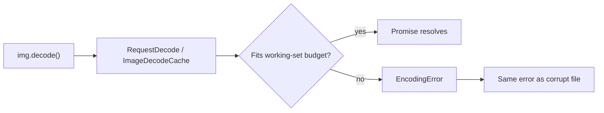

# Chrome image decode cache and the lightbox preview bug

A short note on why large photos in the lightbox sometimes stayed on preview quality, and what we changed.

## Symptom

Open a folder of large JPGs (50+ MP), view the first image at full resolution, navigate to the next — the neighbor image gets stuck on the thumbnail/preview. Close and reopen on that image directly: still preview. The bytes loaded fine; only the full-resolution decode path failed.

## What `img.decode()` actually does

`HTMLImageElement.decode()` asks Chrome to pre-decode the image and **pin** it in the compositor’s raster cache so the next paint is jank-free. That path has hard memory budgets, not unlimited heap.

Documented defaults in Chromium source:

| Budget                              | Size   |
| ----------------------------------- | ------ |
| Decoded-image working set (default) | 128 MB |
| Same budget on low-end devices      | 32 MB  |
| Same budget when system RAM ≥ 4 GB  | 256 MB |
| Blink shared decode cache (locked)  | 64 MB  |

A single 54 MP frame at RGBA is roughly `9504 × 6336 × 4 ≈ 241 MB` — **one photo can exceed the default working set by itself**. The lightbox also preloads the next image, so two full-size decodes can run together and compete for the same budget.

When the compositor cannot lock decoded pixels, `ImageController` reports decode failure; Blink rejects `img.decode()` with:

```text
DOMException: The source image cannot be decoded.
name: EncodingError
```

That string is the same one used for corrupt files and torn-down documents. It is not a reliable signal of a bad JPEG.



## Known Chromium issues

The public tracker requires sign-in; these IDs come from redirects and third-party reports:

| Issue                                                                                                    | Notes                                                                                                                                                                                |
| -------------------------------------------------------------------------------------------------------- | ------------------------------------------------------------------------------------------------------------------------------------------------------------------------------------ |
| [40676514](https://issues.chromium.org/issues/40676514) (was [crbug/1055828](https://crbug.com/1055828)) | Parallel `img.decode()` hitting memory limit — cited by [WeatherLayers](https://docs.weatherlayers.com/weatherlayers-gl/changelog) and manga-reader reports                          |
| [40261318](https://issues.chromium.org/issues/40261318)                                                  | Batch / large-dimension `img.decode()` on valid images — cited by [Odoo](https://github.com/odoo/odoo/pull/243133) and [Nuxt Image #2130](https://github.com/nuxt/image/issues/2130) |

Chrome engineers discussed pin-memory limits when designing the API ([WHATWG html#2037](https://github.com/whatwg/html/issues/2037)). Treating `EncodingError` as permanent image corruption in app code is a common mistake.

## What went wrong in the gallery

Three things compounded:

1. **Preload** — opening image A started a full decode for B while A’s decoded frame was still pinned.
2. **Thumbnail strip** — falling back to `fullImage.data()?.src` subscribed every visible strip entry to a full-resolution decode.
3. **Failure handling** — `withAsyncData` cached `null` after `EncodingError`, so the image never recovered even though `naturalWidth > 0` proved the bytes were fine.

## What we changed

**Serialize full-size decodes** — `src/models/imageDecodeConcurrency.ts` allows one active `img.decode()` at a time (`maxParallelImageDecodes = 1`), integrated in `decodeImageFromUrl` in `src/reatomImage.ts`.

**Treat cache pressure as non-fatal** — if `decode()` throws `EncodingError` but the element loaded (`naturalWidth > 0`), return the `HTMLImageElement` undecoded and let the renderer decode at paint size.

**Stop accidental full-image subscriptions** — thumbnail strip uses `thumbnail.data()?.url` only, not `fullImage`.

## Takeaways for gallery code

- Prefer serialized `img.decode()` for large originals; parallel preloads are risky in Chrome.
- Never map `EncodingError` → “broken file” without checking that bytes did not load.
- Keep expensive atoms off UI that only needs thumbnails.
- Regression coverage: `src/reatomImage.test.ts` (unit), `src/components/Lightbox.stories.tsx` (story interactions on `src/__fixtures__/personal/` ~54 MP JPEGs).
