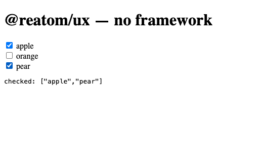

# `@reatom/ux` — no-framework example

A tiny demo that binds [`@reatom/ux`](../../packages/ux) headless models to
**plain DOM**, with no view library at all — so the "view-agnostic" claim is
something you can run, not just read.



## What it shows

A `@reatom/ux` model exposes reactive **prop records** — `computed` values of
plain objects (`checked`, the `aria-*` attributes, `ref`, and the event
handlers). A view adapter applies a record to a real element: `@reatom/jsx` does
it with `$spread`, React with a plain spread. Here a ~15-line `spread` helper in
[`src/main.ts`](./src/main.ts) does the same by hand, so the example depends on
nothing but `@reatom/core` and `@reatom/ux`.

One `reatomCheckbox` group backs the three checkboxes; checking a box updates the
shared array value, and a reactive subscription prints it to the page.

## Run it

From the repository root (workspace packages are built once):

```sh
pnpm install
pnpm --filter @reatom/ux run build
pnpm --filter reatom-ux-vanilla run dev
```

Open the printed local URL. `pnpm --filter reatom-ux-vanilla run build`
type-checks and bundles the example.
