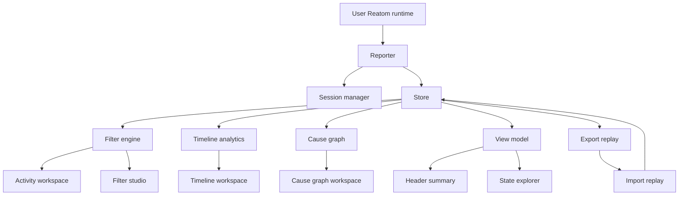
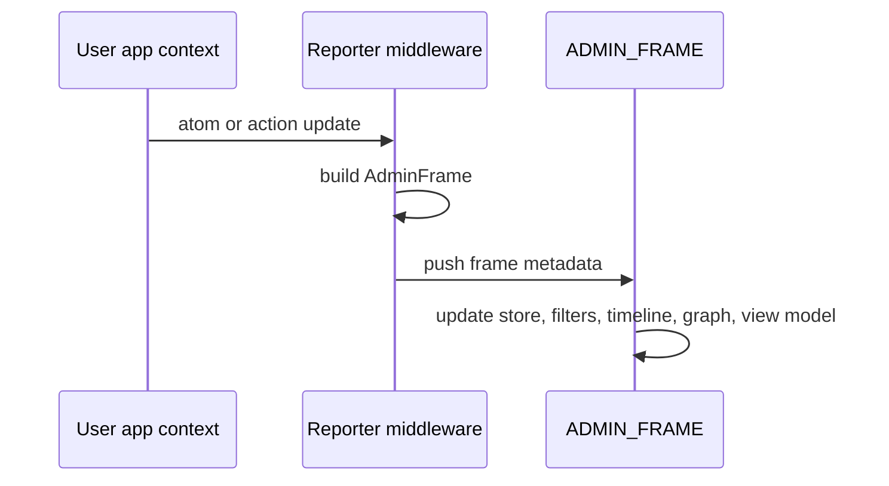
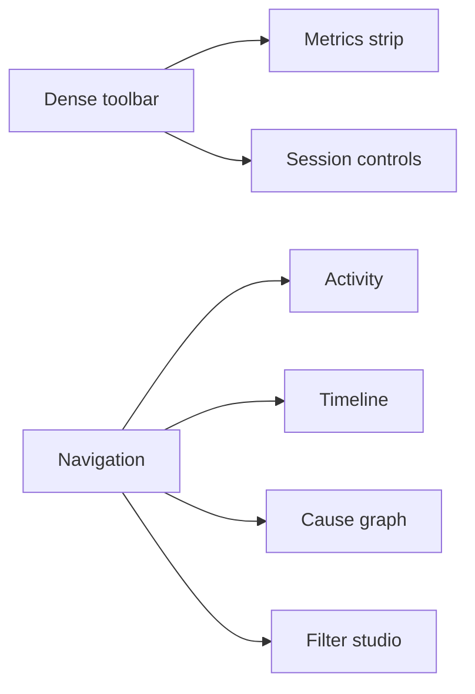
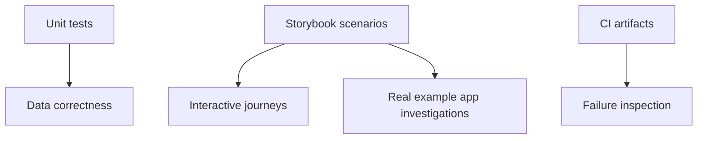

# @reatom/admin — Technical Specification

## Product objective

`@reatom/admin` is now a unified debugging product rather than a data-layer
prototype.

It has two primary modes:

1. **Live devtools** for in-page debugging during development
2. **Replay analysis** for exported sessions that can be inspected later without
   a backend

## High-level architecture



## Context isolation

Admin state continues to live inside `ADMIN_FRAME`, which isolates admin atoms
from the application under inspection.



This guarantees:

- admin internals are not self-recorded
- the product can observe the app without polluting the app context
- live and replay sessions share the same downstream UI model

## Core serializable entities

### `AdminAtom`

- stable atom metadata
- shared across all frames referencing the same runtime atom

### `AdminFrame`

- timestamped frame record
- holds:
  - `state`
  - `params`
  - `payload`
  - `error`
  - `pubIds`

### `AdminSession`

- stable session identifier
- start timestamp
- arbitrary metadata payload

## Store responsibilities

The store is now responsible for more than simple frame retention.

### Primary responsibilities

- maintain live and replay sources
- hold the selected frame
- export and import serialized sessions
- derive frame indexes and time ranges

### New UI-facing derived state

- total frame count
- total error count
- unique atom count
- latest frame per atom
- latest frame list
- current resolved session

These derivations support:

- metrics strip
- state explorer construction
- inspector history navigation
- source badges and replay state

## Filter system

The filter model now powers a real filter studio rather than a placeholder
toolbar.

### Predicate support

- text
- regex
- time range
- error
- cause traversal
- session
- kind

### Built-in kinds

- reactive
- action
- async
- reject
- fulfill

### Built-in tags

- error
- action
- reactive
- async
- reject
- fulfill

### Saved rule model

Each saved rule now contains:

- stable id
- name
- enabled flag
- mode
- optional highlight color
- nested expression tree

### Persistence

When browser storage is available, the following are persisted:

- custom tags
- saved filter configs
- search query
- search target
- draft expression

## View model

The view model is a dedicated adapter between the reactive data layer and the
product UI.

### Responsibilities

- compute summary cards
- build the full state tree
- build the visible state tree

### Summary shape

- total frames
- visible frames
- hidden frames
- highlighted frames
- error frames
- unique atoms
- source
- selected frame id

## Product shell

The UI is now organized as a multi-workspace product shell.



### Header

- compact brand + Live/Replay source pill
- recording status beside the Pause/Resume capture toggle
- session metadata as muted text
- inline metrics strip (captured, visible, hidden, errors, atoms)
- compact session actions (export, import, clear, fresh)

### Devtools dock

- corner grip resizes only (`nwse-resize`); toolbar left-pads to clear it
- minimize lives in the HeaderBar toolbar (rightmost) and collapses to a floating expand pill
- `show()` / `hide()` API unchanged

### Activity workspace

- search and quick built-in filters
- master–detail feed + inspector with independent scroll
- structured frame inspector
- recent atom history
- state explorer

### Timeline workspace

- bucket size control
- zoom control
- offset control
- bucket focus panel

### Cause graph workspace

- direction switching
- depth limit control
- path-from control
- node select vs Focus (re-root)

### Filter studio

- saved rule cards first
- nested expression editor + predicate builder
- save-as actions below the draft (disabled when empty)
- two-step confirm for clearing saved rules

## Testing strategy

The package now has a dedicated multi-layer testing strategy.



### Unit tests

Cover:

- reporter
- store
- predicates
- tags
- expressions
- engine
- timeline
- cause graph
- view model

### Storybook scenarios

Stories are written as real debugging journeys, including:

- real example app instrumentation
- deterministic user flows
- collected log investigation
- replay-safe admin workflows
- setup order guarantees for atom and action registration

### CI pipeline expectations

The repository workflow should run:

- `@reatom/core` tests
- `@reatom/admin` unit tests
- `@reatom/admin` Storybook scenario tests

Failure artifacts should include any browser screenshot outputs generated by the
runner.

## Public API

```ts
interface AdminOptions {
  maxFrames?: number
  metadata?: Record<string, unknown>
  match?: (name: string) => boolean
  onFrame?: (frame: AdminFrame) => void
}

interface Admin {
  reporter: ...
  session: ...
  store: ...
  filters: ...
  timeline: ...
  causeGraph: ...
  view: ...
  dispose: () => void
}
```

The `view` branch is intentionally public because the shell relies on it for
summary cards and state explorer rendering, and custom hosts may want the same
derived state.
