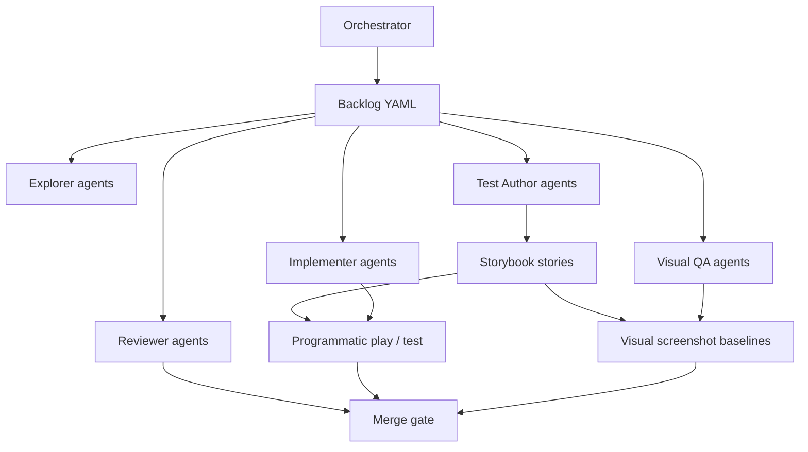

# @reatom/admin — Multi-Agent Orchestration Workflow

## TL;DR

This workflow turns `@reatom/admin` development into a **parallel, story-driven product pipeline**. Every feature starts as a failing Storybook journey, passes programmatic assertions, and ends with a committed visual baseline. Multiple agent sessions coordinate through `workflow/backlog.yaml`, role briefs in `workflow/roles/`, and strict priority / cancellation rules so work never stalls on one track.

## Why this exists

The admin package is a **product surface**, not a library stub. It needs:

- dozens of realistic debugging journeys (Activity, Timeline, Graph, Filters, Replay)
- visual regression on the devtools shell
- continuous coordination across parallel agent sessions

Regular “fix the bug and move on” agent work does not scale. This workflow defines **roles, priorities, handoffs, and exit criteria** so many sessions can converge on one shippable debugger.

## Architecture



## Agent roles

| Role | Owns | Delivers | Must not |
|------|------|----------|----------|
| **Orchestrator** | backlog priority, session assignment, cancellation | updated `backlog.yaml`, unblock decisions | implement features directly |
| **Explorer** | codebase + product gap research | findings, story proposals | large refactors |
| **Test Author** | Storybook journeys (red phase) | failing `play` / `.test()` + `@visual` story stub | hide domain logic in shared helpers |
| **Implementer** | admin runtime + UI (green phase) | minimal fix to pass stories | skip visual validation |
| **Visual QA** | screenshot baselines + flake control | stable `@visual` baselines, viewport notes | change product behavior without test author |
| **Reviewer** | Reatom conventions + scope | review notes, merge recommendation | rewrite unrelated code |

Role briefs: [`workflow/roles/`](roles/).

## TDD loop (mandatory)

Every task follows **Storybook e2e TDD**:

1. **Red** — Test Author adds a story with:
   - realistic user journey in `play` or `.test()`
   - `@smoke` or `@visual` tags
   - programmatic assertions first (logs, navigation, frame detail)
2. **Green** — Implementer makes the smallest change to pass.
3. **Visual** — Visual QA captures / updates `toMatchScreenshot` baseline on the **devtools host** via `matchAdminScreenshot()`.
4. **Refactor** — only after green + visual; no behavior change without story update.

### Rules from `.storybook/README.md`

- Domain flows stay **inline in stories**.
- Shared helpers (`testing.ts`, `admin-navigation.ts`, `visual.ts`) are **system-level only**.
- Never add helpers like `playWinningGame()` or `assertCheckoutRollbackFlow()`.

## Test tiers

| Tier | Command | Gate |
|------|---------|------|
| Unit | `pnpm test:unit` | every PR |
| Smoke stories | `pnpm test:stories:smoke` | every PR |
| Full stories | `pnpm test:stories` | main / labeled PRs |
| Visual | `pnpm test:stories:visual` | main + before release |

Tags:

- `@smoke` — fast critical paths (< 30s total target)
- `@visual` — screenshot baselines; update intentionally with `vitest --update`

## Parallel session protocol

### 1. Claim work

Orchestrator assigns the highest **open** task whose `blocked_by` list is empty.

Each agent session updates `backlog.yaml`:

```yaml
status: in_progress
owner: cursor/session-<id>
```

### 2. Work in vertical slices

Prefer **one workspace journey per session** (e.g. “Timeline bucket selection”), not horizontal “fix all TypeScript” unless tagged `infra`.

### 3. Handoff artifact

Before ending a session, leave:

- story file path(s)
- commands run + exit codes
- screenshot baseline paths (if visual)
- `backlog.yaml` status → `done` or `blocked`

### 4. Anti-stuck rules

| Signal | Action |
|--------|--------|
| Same task `in_progress` > 2 iterations with no new failing test | **Cancel** implementation attempt; Test Author narrows story |
| Flaky screenshot 3 times | Visual QA stabilizes viewport/timing; do not weaken assertions |
| Blocked dependency | Orchestrator spawns Explorer on blocker or splits task |
| Scope explosion | Orchestrator splits task; mark original `cancelled` with reason |
| Infra failure (vite, playwright, CI) | Tag `infra`, priority **P0**, all feature work pauses |

### 5. Cancellation policy

Cancel when:

- duplicate of another open task
- blocked with no path within one Explorer session
- superseded by a smaller vertical slice

Always record `cancel_reason` in backlog.

## Priority model

| Priority | Meaning | Examples |
|----------|---------|----------|
| **P0** | Blocks all testing / CI | missing deps, storybook won't start |
| **P1** | Core product journeys | Activity, Timeline, Replay |
| **P2** | Secondary workspaces | Graph, Filters studio |
| **P3** | Polish | mobile variants, a11y enforcement |

Orchestrator may promote/demote based on release goals.

## File map

| Path | Purpose |
|------|---------|
| `workflow/backlog.yaml` | Single source of truth for tasks |
| `workflow/roles/*.md` | Role instructions for agent sessions |
| `src/testing/visual.ts` | Screenshot helpers |
| `src/testing/admin-navigation.ts` | Shadow-DOM route navigation |
| `src/stories/admin-shell/` | Minimal fixture journeys |
| `src/stories/reatom-jsx-xo/` | Full integration app |
| `.storybook/README.md` | Actor + locator conventions |

## CI expectations

GitHub Actions `test.yml` runs:

1. `@reatom/core` unit tests
2. `@reatom/admin` unit tests
3. `@reatom/admin` storybook browser tests (Playwright container)

Failed story tests attach browser screenshots from Vitest setup.

## Starting a new agent session

```sh
cd /workspace/packages/admin
pnpm install            # from repo root if needed
pnpm setup:chromium
pnpm storybook          # optional local debugging
pnpm test:stories:watch # TDD loop
```

1. Read `workflow/backlog.yaml`
2. Read your role brief in `workflow/roles/`
3. Claim highest-priority open task
4. Write failing story first
5. Implement, screenshot, update backlog
6. Run `pnpm test` before handoff

## Current baseline coverage

| Area | Unit | Smoke story | Visual |
|------|------|-------------|--------|
| Reporter / store / filters | yes | partial (XO) | no |
| Activity / Log | yes | counter + XO | counter activity |
| Timeline | yes | counter journey | counter timeline |
| Cause graph | yes | no | no |
| Filter studio | yes | no | no |
| Replay import/export | yes | no | no |

See `workflow/backlog.yaml` for the full remaining queue.
