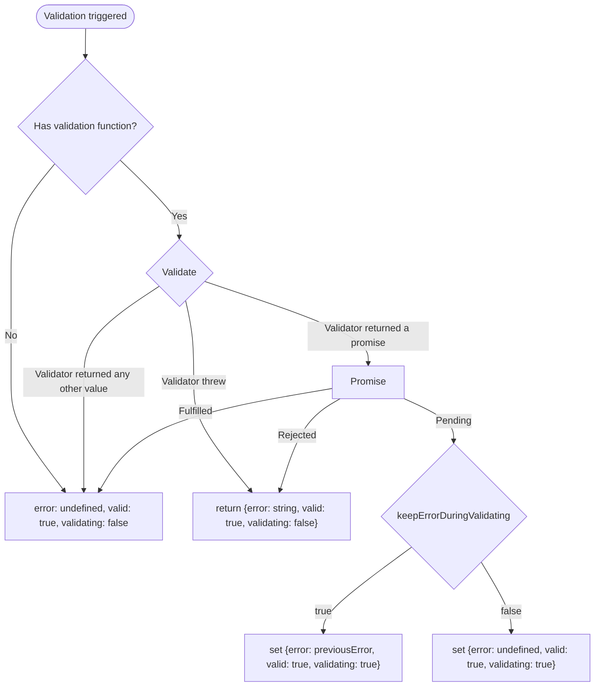

This is a general form library with a simple focus and validation management.

**The API is unstable and will be changed during minor updates!** Sorry for the semver mismatch, the first releases contained A LOT OF bugs and should have been released with an "experimental" tag. Until this note is present here, please don't consider the library stable.

The form API is designed for the best type-safety and flexibility. Instead of setting up the form state with a single object, each field is created separately, giving you the ability to fine-tune each field perfectly. As the field and its meta statuses are stored in atoms, you can easily combine them, define hooks, and effects to describe any logic you need.

The cherry on the cake is dynamic field management. You don't need to use weird string APIs like `form.${index}.property`. Instead, you can simply have a list of atom fields using [atomization](https://www.reatom.dev/recipes/atomization/).

## Installation

```sh
npm i @reatom/form
```

## Usage

```ts
import { reatomForm } from '@reatom/form'

export const loginForm = reatomForm(
  {
    async onSubmit(ctx) {
      const user = await api.login(ctx, {
        name: ctx.get(nameField),
        password: ctx.get(passwordField),
      })
    },
  },
  'loginForm',
)
export const nameField = loginForm.reatomField({ initState: '' }, 'nameField')
export const passwordField = loginForm.reatomField(
  {
    initState: '',
    validate(ctx, { state }) {
      if (state.length < 6) throw new Error('The password should have at least six characters.')
    },
  },
  'passwordField',
)
```

You could find more examples in [reatom/form-web](https://www.reatom.dev/package/form-web/) package.

### Form API

The `loginForm` above has a few fields to track and manage the form.

- `fieldsListAtom`: Atom with a list of fields created by this form's `reatomField` method.
- `focusAtom`: Atom with focus state of the form, computed from all the fields in `fieldsListAtom`
- `onSubmit`: Submit async handler. It checks the validation of all the fields in `fieldsListAtom`, calls the form's `validate` options handler, and then the `onSubmit` options handler. Check the additional options properties of async action: https://www.reatom.dev/package/async/.
- `reatomField`: This method is similar to the `reatomField` method, but it includes bindings to `fieldsListAtom`. It also provides an additional `remove` method to clean itself up from `fieldsListAtom`.
- `reset`: Action to reset the state, the value, the validation, and the focus states.
- `validationAtom`: Atom with validation state of the form, computed from all the fields in `fieldsListAtom`
- `formValidationAtom`: Atom with validation statuses around form `validate` options handler.

### Form options

- `onSubmit`: The callback to process valid form data
- `onSubmitError`: The callback to handle validation errors on the attempt to submit
- `validate`: The callback to validate form fields.

### Form validation behavior

The `form.onSubmit` call triggers the validation process of all related fields (which are stored in `fieldsListAtom`). After that, the validation function from the options will be called. If there are no validation errors, the `onSubmit` callback in the options is called. If the validation fails, the `onSubmitError` callback is called.

You can track the submitting process in progress using `form.onSubmit.pendingAtom`.

### Field API

A field (`FieldAtom` type) itself is an atom, and you can change it like a regular atom by calling it with the new value or reducer callback.

The atom stores "state" data. However, there is an additional `valueAtom` that stores "value" data, which could be a different kind of state related to the end UI. For example, for a select field, you want to store the `string` "state" and `{ value: string, label: string }` "value," which will be used in the "Select" UI component.

Here is the list of all additional methods.

- `initState`: The initial state of the atom, readonly.
- `focusAtom`: Atom of an object with all related focus statuses. This atom has additional `reset` action. State properties:
  - `active`: The field is focused.
  - `dirty`: The field's state is not equal to the initial state. You can manage this using the [`isDirty` option](#field-options).
  - `touched`: The field has gained and lost focus at some point.
- `validationAtom`: Atom of an object with all related validation statuses. This atom has additional `reset` action. State properties:
  - `error`: The field's validation error text, undefined if the field is valid.
  - `valid`: The validation status of the field. Indicates that the validation is up to date. A `true` value does not mean that the state is correct, it means that validation has taken place. Any change to the state of the field will drop this status to `false` (it could synchronously return to `true` if validation is triggered).
  - `validating`: The field's async validation status.
- `valueAtom`: Atom with the "value" data, computed by the [`fromState` option](#field-options).
- `blur`: Action for handling field blur.
- `change`: Action for handling field changes, accepts the "value" parameter and applies it to [`toState` option](#field-options).
- `focus`: Action for handling field focus.
- `reset`: Action to reset the state, the value, the validation, and the focus.
- `validate`: Action to trigger field validation.

By combining this statuses you can know a different meta info too.

- `!touched && active` - the field get focus first time
- `touched && active` - the field get focus another time

### Field validation behavior

You can set a validation function and manage validation triggers using [the options](#field-options). The flow looks like this.



### Field options

- `initState`: The initial state of the atom, which is the only required option.
- `filter`: The optional callback to filter "value" changes (from the 'change' action). It should return 'false' to skip the update. By default, it always returns `false`.
- `fromState`: The optional callback to compute the "value" data from the "state" data. By default, it returns the "state" data without any transformations.
- `isDirty`: The optional callback used to determine whether the "value" has changed. Accepts context, the new value and the old value. By default, it utilizes `isDeepEqual` from reatom/utils.
- `toState`: The optional callback to transform the "state" data from the "value" data from the `change` action. By default, it returns the "value" data without any transformations.
- `validate`: The optional callback to validate the field.
- `keepErrorDuringValidating`: Defines the reset behavior of the validation state during async validation. It is `false` by default.
- `validateOnBlur`: Defines if the validation should be triggered on the field blur. `true` by default
- `validateOnChange`: Defines if the validation should be triggered with every field change. `!validateOnBlur` by default
