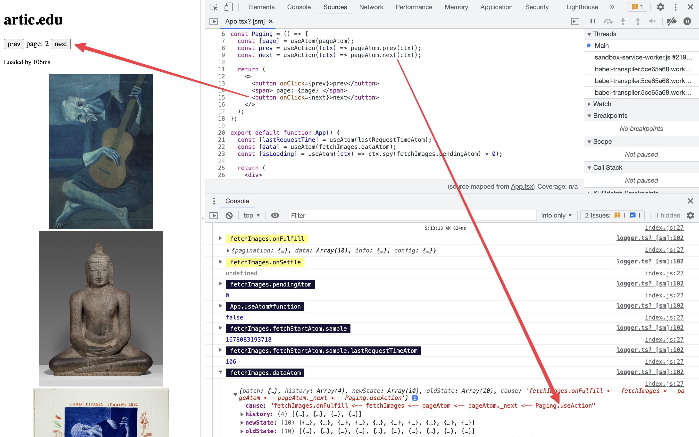

Tiny logger with a couple nice configurations.

> included in [@reatom/framework](https://www.reatom.dev/packages/framework)

## Usage

All atoms and actions with names or without underscore logs automatically

```ts
import { connectLogger, createLogBatched } from '@reatom/logger'

connectLogger(ctx)

// OR

connectLogger(
  ctx,
  // optional configuration
  {
    // the length of the atom history (patches) to store
    history: 10,
    // `false` by default to made your logs short
    showCause: false,
    // `true` by default to made your logs clear
    skipUnnamed: true,
    // fine tuning :)
    skip: (patch: AtomCache) => false,
    // `createLogBatched` by default to not spam you a lot
    // you could pass regular `console.log` here
    log: createLogBatched(
      // optional configuration
      {
        // 500ms by default
        debounce: 500,
        // 5000ms by default, it helps to not stuck with WS and so on
        limit: 5000,
        // `toLocaleTimeString` by default
        getTimeStamp: () => new Date().toLocaleTimeString()

        log: console.log,
        // `true` by default to group logs by name
        shouldGroup: true,
      },
    ),
    // You could customize a logs group: `Reatom ${domain}N transactions`
    domain: '',
  },
)
```

Every log record includes a number in the start of the name to fix autosorting keys in a console.

Here is how it looks like ([from this example](https://www.reatom.dev/examples#search-component)):


