# Reatom agent skills

## Repository layout

**Edit only `plugin/skills/`.** Every other skills path and several external readmes are symlinks to files here.

```mermaid
flowchart TD
  subgraph canonical ["plugin/skills/ — edit here"]
    R["reatom/REFERENCE.md"]
    RJ["reatom-jsx/REFERENCE.md"]
    SkillsTree["SKILL.md files + README.md"]
  end

  subgraph manifests ["plugin/ — the installable plugin"]
    ClaudePlugin[".claude-plugin/plugin.json"]
    CodexPlugin[".codex-plugin/plugin.json"]
    CursorPlugin[".cursor-plugin/plugin.json"]
  end

  subgraph agentDirs ["Agent discovery — directory symlinks"]
    Root["skills → plugin/skills"]
    Cursor[".cursor/skills → ../plugin/skills"]
    Agents[".agents/skills → ../plugin/skills"]
    Claude[".claude/skills → ../plugin/skills"]
  end

  subgraph external ["External readmes — file symlinks"]
    Summary["summary.md"]
    Docs["docs/src/content/docs/summary.md"]
    Core["packages/core/README.md"]
    JSX["packages/jsx/README.md"]
  end

  SkillsTree --> ClaudePlugin
  SkillsTree --> CodexPlugin
  SkillsTree --> CursorPlugin
  SkillsTree --> Root
  SkillsTree --> Cursor
  SkillsTree --> Agents
  SkillsTree --> Claude
  R --> Summary
  R --> Docs
  R --> Core
  RJ --> JSX
```



| Path                               | Role                                                    |
| ---------------------------------- | ------------------------------------------------------- |
| `plugin/skills/`                   | Canonical skill files — **only edit here**              |
| `skills/`                          | Symlink → `plugin/skills/` (historical path)            |
| `.cursor/skills/`                  | Symlink → `plugin/skills/` (Cursor discovery)           |
| `.agents/skills/`                  | Symlink → `plugin/skills/` (Codex discovery)            |
| `.claude/skills/`                  | Symlink → `plugin/skills/` (Claude Code project skills) |
| `.claude-plugin/marketplace.json`  | Claude Code marketplace catalog                         |
| `.agents/plugins/marketplace.json` | Codex marketplace catalog                               |
| `.cursor-plugin/marketplace.json`  | Cursor marketplace catalog                              |
| `plugin/.claude-plugin/`           | Claude Code plugin manifest                             |
| `plugin/.codex-plugin/`            | Codex plugin manifest                                   |
| `plugin/.cursor-plugin/`           | Cursor plugin manifest                                  |
| `CLAUDE.md`                        | Symlink → `AGENTS.md` (Claude Code instructions)        |

Skills live under `plugin/` because every client copies the whole plugin directory into its cache on install: `plugin/` is ~170 KB, the repository is ~250 MB.

| Symlink                            | Points to                               |
| ---------------------------------- | --------------------------------------- |
| `summary.md`                       | `plugin/skills/reatom/REFERENCE.md`     |
| `docs/src/content/docs/summary.md` | `plugin/skills/reatom/REFERENCE.md`     |
| `packages/core/README.md`          | `plugin/skills/reatom/REFERENCE.md`     |
| `packages/jsx/README.md`           | `plugin/skills/reatom-jsx/REFERENCE.md` |

**Do not diff, merge, or sync symlink targets.** Paths like `summary.md` and `packages/core/README.md` are the same content as `plugin/skills/reatom/REFERENCE.md`. Comparing them wastes time and tokens.

---

Agent skills for [Reatom v1001](https://v1001.reatom.dev).

## Install

Any agent, with the [skills CLI](https://skills.sh/):

```bash
# All skills
npx skills add reatom/reatom

# Individual skills
npx skills add reatom/reatom --skill reatom
npx skills add reatom/reatom --skill reatom-async
npx skills add reatom/reatom --skill reatom-jsx
npx skills add reatom/reatom --skill reatom-review
```

Claude Code, from the plugin marketplace hosted in this repository:

```bash
/plugin marketplace add reatom/reatom
/plugin install reatom@reatom
```

Codex, from the same repository:

```bash
codex plugin marketplace add reatom/reatom
codex plugin add reatom@reatom
```

Cursor reads `.cursor-plugin/marketplace.json`: add `reatom/reatom` under Dashboard → Plugins → Add Marketplace → Import from Repo, then install the `reatom` plugin it lists.

The plugin ships all four skills at once and follows the `v1001` branch: it has no pinned `version`, so an update picks up the latest commit.

Contributors working in a checkout need no install — `.cursor/skills/`, `.agents/skills/`, and `.claude/skills/` point at `plugin/skills/`.

| Skill           | Bundled reference                                                  |
| --------------- | ------------------------------------------------------------------ |
| `reatom`        | `REFERENCE.md` — compact v1001 API reference                       |
| `reatom-async`  | `REFERENCE.md` — async flows, cancellation, sampling, and Suspense |
| `reatom-jsx`    | `REFERENCE.md` — `@reatom/jsx` package docs                        |
| `reatom-review` | review checklist (loads `reatom` skill for API reference)          |

Full docs: [v1001.reatom.dev](https://v1001.reatom.dev)
