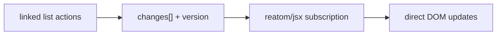

# JSX

## Features

- **⚡️ Zero re-renders:** reactive bindings update DOM directly
- **🧩 Native elements:** `<div />` returns a real DOM node
- **🛠 No extra build step:** just TSX and TypeScript support
- **🎯 Tiny footprint:** ~3KB runtime (plus a minimal core)
- **🎨 Built-in styles:** efficient via CSS variables
- **🛡 Error boundaries:** isolate UI failures with `<ErrorBoundary>` and track via `jsxError`

[](https://stackblitz.com/github/reatom/reatom/tree/v1001/examples/reatom-jsx)

## Installation

```sh
npm install @reatom/core @reatom/jsx
```

Set up TypeScript to use the JSX runtime:

`tsconfig.json`:

```json
{
  "compilerOptions": {
    "moduleResolution": "bundler",
    "jsx": "preserve",
    "jsxImportSource": "@reatom/jsx"
  }
}
```

For Vite users:

`vite.config.js`:

```js
import { defineConfig } from 'vite'
import { reatom } from '@reatom/vite'

export default defineConfig({
  plugins: [reatom()],
  esbuild: {
    jsxFactory: 'h',
    jsxFragment: 'hf',
    jsxInject: `import { h, hf } from "@reatom/jsx"`,
  },
})
```

`@reatom/vite` also wires routing and `mount()` hot updates — see [Hot module replacement](#hot-module-replacement-vite).

## Framework compatibility

You can integrate `@reatom/jsx` into existing React or other JSX projects.

1. Create a separate package for Reatom-based components
2. Extend(https://www.typescriptlang.org/tsconfig#extends) your base `tsconfig.json` with JSX config
3. In each file, declare JSX pragma manually:

```tsx
// @jsxRuntime classic
// @jsx h
import { h } from '@reatom/jsx'
```

This enables you to gradually migrate or optimize parts of your app without conflict with existing tooling.

## Example

> 💡 See a more advanced version with dynamic entities:
> https://github.com/reatom/reatom/tree/v1001/examples/reatom-jsx

Define a component:

```ts
import { atom } from '@reatom/core'

const value = atom('')
// Event handlers shouldn't be wrapped, Reatom take care of it
const onInput = (event: Event & { currentTarget: HTMLInputElement }) =>
  value.set(event.currentTarget.value)

const Input = () => <input value={value} on:input={onInput} />
```

Mount your app:

```tsx
import { connectLogger, context, clearStack } from '@reatom/core'
import { mount } from '@reatom/jsx'
import { App } from './App'

// Disable default global context to enforce explicit context usage (recommended)
clearStack()

// Create a root context for the application
const rootContext = context.start()

if (import.meta.env.MODE === 'development') {
  connectLogger()
}

// Mount the app within the created context
const { unmount } = mount(document.getElementById('app')!, <App />)

// Later, to unmount and cleanup:
// unmount()
```

The `mount` function returns an `unmount` property callback (similar to React's `root.unmount()`). When called, it:

1. Disconnects the internal MutationObserver
2. Unsubscribes from all reactive atoms
3. Calls all `ref` unmount callbacks
4. Removes the element from the DOM

### Hot module replacement (Vite)

During development, the bundler can replace a module without a full reload. The old DOM tree and Reatom subscriptions stay alive unless you tear them down.

Prefer [`@reatom/vite`](https://www.reatom.dev/reference/vite) — add `reatom()` to your Vite plugins and `mount()` cleanup is injected automatically.

Or handle it manually: call `unmount()` from the previous `mount` inside `import.meta.hot.dispose` so the updated module can mount a fresh tree:

```tsx
const root = document.getElementById('app')!
const { unmount } = mount(root, <App />)

if (import.meta.hot) {
  import.meta.hot.dispose(() => {
    unmount()
  })
  import.meta.hot.accept()
}
```

## Reference

This package implements a [JSX factory](https://www.typescriptlang.org/tsconfig#jsxFactory) that creates and binds **native** DOM elements with reactivity.

### Props

JSX props are treated as follows:

- Default: set as DOM properties or attributes are used depending on the context, to ensure correct behavior and predictable outcomes.
- `prop:*`: sets DOM properties.
- `attr:*`: sets DOM attributes.
- `on:*`: register event listeners. Functions interacting with Reatom state or actions are wrapped (`wrap`) automatically.

All values can be:

- `null` or `undefined`: removes DOM attribute or resets DOM property
- `string`, `number` or `boolean`: sets property or attribute
- `AtomLike` or a derived function: tracked reactively, the prop is automatically updated when dependencies change

```tsx
const enabled = atom(true)
const value = atom('')
<input
  value={value}
  attr:type="text"
  prop:disabled={() => !enabled()}
  on:input={(event) => value.set(event.currentTarget.value)}
/>
```

### Children

The `children` prop defines element content. It supports:

- `boolean`, `null`, or `undefined` → renders nothing
- `string` or `number` → renders text
- `Node` → inserts DOM node as-is
- `AtomLike` → reactive content

<!--
- `AtomLike` or derived function → reactive content
<span>{() => count() > 5 ? 'high' : 'low'}</span>
-->

```tsx
<div>{count}</div>
```

### Models

Use `model:*` props for two-way binding with native input controls and plain writable atoms.

Supported props:

- `model:value`: binds the `value` property of inputs, useful for text inputs and `<textarea>`
- `model:valueAsNumber`: binds the `valueAsNumber` property, typically used for numeric inputs
- `model:checked`: binds the `checked` property of checkboxes or radio buttons
- `model:field`: binds a `reatomField` / atomized field from `reatomForm` (change, focus, disabled, elementRef)

```tsx
const value = atom('')
const Input = () => <input model:value={value} />
```

Components run once on creation, so it's safe to define atoms or any setup logic inside:

```tsx
const Input = () => {
  const value = atom('')
  return <input model:value={value} />
}
```

### Forms

For real forms — validation, submit, focus/dirty state — use `reatomForm` from `@reatom/core` with JSX bindings:

- `<form model={form}>` — `preventDefault`, calls `form.submit()`, toggles `data-submitting` / `data-submitted` / `data-submit-error` (and matching classes) on the form element
- `model:field={form.fields.name}` — wires each input through `field.change` and focus tracking

Use `model:value` / `model:checked` for simple controls (search, toggles). Use `model:field` for form fields. See the [forms handbook](https://v1001.reatom.dev/handbook/forms/).

```ts title="loginForm.ts"
import { reatomForm } from '@reatom/core'

export const loginForm = reatomForm(
  {
    username: '',
    password: '',
    passwordDouble: '',
  },
  {
    validate({ password, passwordDouble }) {
      if (password !== passwordDouble) {
        return 'Passwords do not match'
      }
    },
    onSubmit: async (values) => api.login(values),
    validateOnBlur: true,
    name: 'loginForm',
  },
)
```

```tsx title="LoginForm.jsx"
import { css } from '@reatom/jsx'
import { loginForm } from './loginForm'

const formStyles = css`
  &[data-submitting] [type='submit'] {
    color: transparent;
    position: relative;
    pointer-events: none;
  }
  &[data-submitting] [type='submit']::after {
    content: '';
    position: absolute;
    inset: 0;
    margin: auto;
    width: 1em;
    height: 1em;
    border: 2px solid currentColor;
    border-right-color: transparent;
    border-radius: 50%;
    animation: spin 0.6s linear infinite;
  }
  @keyframes spin {
    to {
      transform: rotate(360deg);
    }
  }
`

export const LoginForm = () => (
  <form model={loginForm} css={formStyles}>
    <input
      model:field={loginForm.fields.username}
      placeholder="Enter your username"
    />
    <span>{() => loginForm.fields.username.validation().error}</span>

    <input
      model:field={loginForm.fields.password}
      attr:type="password"
      placeholder="Enter your password"
    />

    <input
      model:field={loginForm.fields.passwordDouble}
      attr:type="password"
      placeholder="Confirm your password"
    />

    <button type="submit">Login</button>
  </form>
)
```

`<form model={form}>` wires submit (`preventDefault` + `form.submit()`) and toggles `data-submitting`, `data-submitted`, and `data-submit-error` on the form for CSS. The submit button needs no extra props — the spinner above is CSS-only while `data-submitting` is set.

### `style` props

Use `style={{ key: value }}` for inline styles. Falsy values like `false`, `null`, and `undefined` remove the style.

```tsx
<div style={{ top: 0, display: hidden() && 'none' }} />
```

Avoid replacing the full style object — prefer updates via static keys:

❌ **Avoid:**

```tsx
<div style={() => (flag() ? { top: 0 } : { bottom: 0 })} />
```

✅ **Use:**

```tsx
<div
  style={() =>
    flag() ? { top: 0, bottom: undefined } : { top: undefined, bottom: 0 }
  }
/>
```

### `style:*` props

Set individual styles via `style:*`:

```tsx
// <div style="top: 10px; right: 0;"></div>
<div
  style:top={atom('10px')}
  style:right={0}
  style:bottom={undefined}
  style:left={null}
></div>
```

Values can be primitives or reactive (`atom`, `() => string`, etc.). Numbers are passed as-is (no automatic `px`).

### `class` or `className` props

The JSX runtime automatically applies the same logic internally using `reatomClassName`.

```ts
/** @example <button class="button button--size-medium button--theme-primary button--is-active"></button> */
<button class={[
  'button',
  `button--size-${props.size}`,
  `button--theme-${props.theme}`,
  {
    'button--is-disabled': props.isDisabled,
    'button--is-active': props.isActive() && !props.isDisabled(),
  },
]}></button>
```

### CSS-in-JS

The `css` prop provides an ideal architectural balance for styling: it keeps styles colocated with the markup they affect while avoiding the coupling issues of other approaches.

Use the `css` prop to declare styles via tagged template literals. Dynamic values can be passed as CSS variables via `css:*`.

```tsx
const Component = () => (<input
  css:size={size}
  css="font-size: calc(1em + var(--size) * 0.1em);"
></div>)
```

This will be compiled to:

```tsx
<div data-reatom-style="1" data-reatom-name="Component" style="--size: 3"></div>
```

Behind the scenes, the runtime:

- Generates a unique style ID and sets it as `data-reatom-style` attribute
- Inserts the CSS rule once using attribute selector (`[data-reatom-style="1"]`)
- Applies dynamic values as inline CSS variables (`--size`)
- Sets `data-reatom-name` attribute with the component name for better DevTools traceability

#### Why css-prop?

Every styling approach forces trade-offs. CSS-modules and SFC style tags split your component across files. Tailwind requires learning a new vocabulary and clutters your markup. Styled-components and Linaria add runtime overhead or complex build pipelines.

The `css` prop takes a different path: **just write CSS where you use it**. No preprocessing, no new syntax to learn — Reatom passes your styles directly to the DOM. You still get [native CSS nesting](https://developer.mozilla.org/en-US/docs/Web/CSS/CSS_nesting/Using_CSS_nesting), readable component names in DevTools via `data-reatom-name` attribute, and zero build complexity.

But the real win is architectural. When styles live inline, growing components naturally want to be **extracted as new components** — not split into separate style files. This keeps markup and styles together, maintaining high cohesion and low coupling. The path of least resistance leads to better code organization.

> Tip: wrapping logic in components improves `data-reatom-name` readability and traceability.

> Prettier formats `css` template literals correctly, and the [vscode-styled-components](https://marketplace.visualstudio.com/items?itemName=styled-components.vscode-styled-components) extension provides syntax highlighting.

#### CSS Mixins

Since styles are just strings, you can build your own design system with plain JavaScript — no framework magic required.

Mix utilities with custom CSS when needed:

```tsx title="Component.tsx"
<div
  css={`
    ${card}
    max-width: 400px;
    box-shadow: 0 4px 12px rgba(0, 0, 0, 0.1);
  `}
/>
```

Use them directly — no template literals needed for simple cases:

```tsx title="Article.tsx"
<main css={center}>
  <article css={card}>
    <h1 css={text(colors.text)}>Hello</h1>
    <button css={bg(colors.primary) + px(4) + py(2) + rounded}>Click me</button>
  </article>
</main>
```

Your design tokens and utilities:

```ts title="styles.ts"
// Tokens
export const colors = {
  primary: '#3b82f6',
  surface: '#f8fafc',
  text: '#1e293b',
}
export const space = [0, 4, 8, 16, 24, 32, 48] as const
export type Size = 0 | 1 | 2 | 3 | 4 | 5 | 6

// Utilities — just strings and functions
export const flex = 'display: flex;'
export const flexCenter = 'justify-content: center; align-items: center;'
export const rounded = 'border-radius: 8px;'

export const p = (n: Size) => `padding: ${space[n]}px;`
export const px = (n: Size) => `padding-inline: ${space[n]}px;`
export const py = (n: Size) => `padding-block: ${space[n]}px;`
export const bg = (color: string) => `background: ${color};`
export const text = (color: string) => `color: ${color};`

export const card = bg(colors.surface) + rounded + p(4)
export const center = flex + flexCenter
```

This gives you the composability of utility-first CSS with full CSS power — all type-safe, all just JavaScript.

#### Conditional Styles with Attributes

We have built-in [class names parsing](#class-or-classname-props) and a reactive helper [`reatomClassName`](#reatomclassname-class-names-reactivity). But often it's simpler and more effective to use native attributes for conditional styles — the attribute becomes both the state indicator and the CSS selector target.

```tsx
const Accordion = ({ title, children }) => {
  const open = atom(false)

  return (
    <details
      open={open}
      css={`
        article {
          display: grid;
          grid-template-rows: 0fr;
          transition: grid-template-rows 0.2s;
        }
        &[open] article {
          grid-template-rows: 1fr;
        }
      `}
    >
      <summary on:click={open.toggle}>{title}</summary>
      <article>
        <div css="overflow: hidden;">{children}</div>
      </article>
    </details>
  )
}
```

Works with ARIA and standard attributes — accessible and styleable in one:

```tsx
// Loading state indicator
<nav aria-busy={loading} css="&[aria-busy='true'] { opacity: 0.5; }">
  {children}
</nav>
```

```tsx
// Invalid form field
<input
  aria-invalid={hasError}
  css="&[aria-invalid='true'] { border-color: red; }"
/>
```

```tsx
// Active tab or custom listbox option
<button
  role="tab"
  aria-selected={selected}
  css={`
    &[aria-selected='true'] {
      border-bottom: 2px solid currentColor;
    }
  `}
>
  {label}
</button>
```

```tsx
// Disabled control (alternative to :disabled that works on any element)
<div
  role="button"
  aria-disabled={disabled}
  css={`
    &[aria-disabled='true'] {
      opacity: 0.5;
      pointer-events: none;
    }
  `}
>
  {children}
</div>
```

Why this pattern works best:

- **Single source of truth** — attribute is both the reactive binding and style condition
- **Accessible by default** — ARIA attributes communicate state to assistive technologies
- **Inspectable** — attributes are visible in DevTools, debugging is trivial
- **Testable** — query by semantic selectors (`[aria-current]`, `[disabled]`) instead of class names

### Components

Components are plain functions that return DOM elements. They are stateless, have no lifecycle, and are evaluated only once — at the moment of mounting.

> There’s no virtual tree or diffing — everything happens directly in the DOM.

For small, rarely changing lists, store elements in an atom and map them inside reactive children (see below). For lists that grow, shrink, or reorder often, use [`reatomLinkedList`](#linked-lists) — it applies structural changes incrementally instead of rebuilding the whole subtree on every edit.

```tsx
const list = atom([<li>1</li>, <li>2</li>])

const add = () =>
  list.set((state) => [...state, <li>{state.length + 1}</li>])

<div>
  <button on:click={add}>Add</button>
  {() => <ul>{list().map((item) => item)}</ul>}
</div>
```

#### ⚠ Do not reuse elements

JSX elements are real DOM nodes, not virtual descriptions. Reusing the same element instance multiple times leads to incorrect rendering — it will only appear in the last place it was inserted. Each JSX element must be created fresh where it's used.

**❌ Incorrect**

```tsx
const shared = <span>{valueAtom}</span>

<>
  <div>{shared}</div>
  <p>{shared}</p>
</>
```

Result:

```html
<div></div>
<p>
  <span>text</span>
</p>
```

Only the last usage is rendered — the first one is silently dropped.

**✅ Correct**

```tsx
const Shared = () => <span>{valueAtom}</span>

<>
  <div><Shared /></div>
  <p><Shared /></p>
</>
```

Result:

```html
<div><span>Hello</span></div>
<p><span>Hello</span></p>
```

Each call creates a unique element with its own lifecycle and subscriptions.

### Linked lists

Reactive array children are perfect for short, mostly-static lists. There is no virtual DOM and no keyed reconciliation here, so a `{() => items().map(...)}` child renders through a live fragment: whenever the array changes, the current children are torn down and the freshly mapped result is inserted in their place. For a handful of items that is exactly what you want — cheap and simple.

Once a list grows long, reorders often, or gets edited many times per interaction, that full rebuild starts to cost you. This is where `reatomLinkedList` from `@reatom/core` earns its place. It keeps every item as a stable node in a doubly linked list, and each structural edit is appended to a change log that bumps a version number. `@reatom/jsx` subscribes to that log and replays only what changed onto the DOM, so the list is patched in place rather than recreated from scratch.



#### Performance vs reactive arrays

| Classic immutable array change                      | Reactive array child       | LL method               | Linked-list child                                      |
| --------------------------------------------------- | -------------------------- | ----------------------- | ------------------------------------------------------ |
| **Add** — `arr.set(state => [...state, next])`      | Rebuilds the live fragment | `create` / `createMany` | Appends nodes, batched in one `DocumentFragment`       |
| **Remove** — `arr.set(state => state.filter(...))`  | Rebuilds the live fragment | `remove` / `removeMany` | Drops the row node (or its live-fragment markers)      |
| **Reorder** — `arr.set(state => [...state].sort())` | Rebuilds the live fragment | `move` / `swap`         | Reuses the same DOM elements via native insertion APIs |
| **Update item** — `arr.set(state => state.with())`  | Rebuilds the live fragment | inner atom `.set()`     | Row node is reused; inner atoms and props update       |

Performance aside, the linked-list methods are simply nicer to live with. `create`, `remove`, `move`, and `swap` say what you mean, while the immutable-array column above leans on index math, spreads, and `filter`/`map`/`with` callbacks — more code to write and more places to get an index wrong. So even for modest lists where rebuild cost is a non-issue, reach for `reatomLinkedList` when you want the friendlier API.

#### Data + view list

`.reatomMap()` keeps a parallel linked list of views, tied back to the source nodes through a `WeakMap`. Since that mapping is stable, `move`, `swap`, and `remove` on the source quietly reuse the matching view rows. The rule to remember: edit the _source_ list, never the mapped view. For example:

```tsx
import { atom, reatomLinkedList } from '@reatom/core'

const todos = reatomLinkedList((title: string) => atom(title), 'todos')

const TodoList = () => (
  <ul>
    {todos.reatomMap((titleAtom) => (
      <li>
        <input model:value={titleAtom} />
        <button on:click={() => todos.remove(titleAtom)}>Remove</button>
      </li>
    ))}
  </ul>
)
```

Examples: [drag-and-drop](https://github.com/reatom/reatom/tree/v1001/examples/reatom-jsx-dnd), [gallery](https://github.com/reatom/reatom/tree/v1001/examples/reatom-jsx-gallery), [`reatomFieldArray`](https://v1001.reatom.dev/handbook/forms/concepts/field-array/) for dynamic form rows.

#### API and when to use

Every structural method records a change: `create`, `createMany`, `remove`, `removeMany`, `move(node, after)` (pass `after === null` to insert at the head), `swap`, `clear`, and `batch` for folding many edits into a single DOM pass. You can also walk the list by hand through `list.LL_PREV` / `list.LL_NEXT`. When you just need a plain snapshot, reach for `list.array()` or `deatomize(list.array)` — great for reading, but not for mounting large dynamic lists. And when lookup by id matters, `reatomLinkedList({ create, key: 'id' })` together with `list.map()` is comfortable for hundreds of items, though you'll want another approach once you reach the thousands.

| Scenario                                   | Use                                                      |
| ------------------------------------------ | -------------------------------------------------------- |
| Tiny list, rare edits                      | Atom + `{() => items().map(...)}`                        |
| Feeds, drag-and-drop, tables, field arrays | `reatomLinkedList` + optional `.reatomMap()`             |
| Lookup by id                               | `reatomLinkedList({ create, key: 'id' })` + `list.map()` |

#### Caveats

- List nodes have to be objects or functions, so wrap primitives in objects, atoms, or DOM elements first.
- The same node cannot appear twice in one list.
- Native `DocumentFragment` rows are not supported.
- `move` and `swap` are still rough on fragment rows, so prefer a single root element per row — or render element rows through `.reatomMap()` and reorder the source nodes instead.

[`reatomLinkedList` core docs](https://v1001.reatom.dev/reference/primitives/#reatomlinkedlist)

### `$spread` prop

Use `$spread` to declaratively bind multiple props or attributes at once. The object can be reactive (e.g., `atom`, `() => obj`) and will update automatically.

```tsx
<div
  $spread={() =>
    valid()
      ? { disabled: true, readonly: true }
      : { disabled: false, readonly: false },
  }
/>
```

> Always include all relevant keys on each update to avoid stale DOM state.

### SVG

To create SVG elements, use the `svg:` namespace prefix to the tag name.

```tsx
<svg:svg viewBox="0 0 24 24">
  <svg:path d="..." />
</svg:svg>
```

> SVG elements are rendered as native DOM nodes in the SVG namespace.

If you need to inject raw SVG markup, use one of the following approaches:

**Option 1**: parse from string

```tsx
const SvgIcon = ({ svg }: { svg: string }) =>
  new DOMParser()
    .parseFromString(svg, 'image/svg+xml')
    .children.item(0) as SVGElement
```

**Option 2**: use `prop:outerHTML`

```tsx
const SvgIcon = ({ svg }: { svg: string }) => <svg:svg prop:outerHTML={svg} />
```

### `ref` props

Use the `ref` prop to get access to the DOM element and register mount/unmount side effects.

```tsx
<button
  ref={(el) => {
    el.focus()
    return (el) => el.blur()
  }}
/>
```

Mount refs run child-first; unmount refs run parent-first:

```tsx
<div
  ref={() => {
    console.log('mount parent')
    return () => console.log('unmount parent')
  }}
>
  <span
    ref={() => {
      console.log('mount child')
      return () => console.log('unmount child')
    }}
  />
</div>
```

Console output:

```txt
mount child
mount parent
unmount parent
unmount child
```

## Error handling

By default, a reactive render or prop failure keeps the last good DOM, reports through `jsxError`, and marks the host with `data-reatom-error` until the next successful update. Abort errors are ignored.

Use `<ErrorBoundary>` to swap a subtree for a fallback:

```tsx
import { addCallHook } from '@reatom/core'
import { ErrorBoundary, jsxError } from '@reatom/jsx'

addCallHook(jsxError, ({ error, phase, name }) => {
  // Sentry / analytics
})

const App = () => (
  <ErrorBoundary
    fallback={(error, retry) => (
      <div>
        {(error as Error).message}
        <button on:click={retry}>Retry</button>
      </div>
    )}
    pending={<div>Loading…</div>}
    onError={(error) => console.error(error)}
  >
    {() => <RiskyView />}
  </ErrorBoundary>
)
```

- Prefer lazy children `{() => <Child />}` (or an atom) so construction-time throws are caught. Eager element children are created before the boundary runs.
- `fallback(error, retry)` renders after a failure; call `retry()` to clear and re-render children.
- Thrown promises use `pending` while unsettled; rejection goes to `fallback`.
- Ownership follows the node's current DOM ancestors — moving a node under another boundary adopts it. The wrapper is a `display: contents` `<span>`.
- `jsxError` phases: `children` | `prop` | `event` | `ref` | `mount`.
- `on:*` handlers report then rethrow; other phases leave sibling subscriptions intact.

Style failed nodes with `[data-reatom-error]` when you rely on the hybrid default path without a boundary.

## Utilities

### `reatomClassName` class names reactivity

`reatomClassName` works similarly to [clsx](https://github.com/lukeed/clsx) or [classnames](https://github.com/JedWatson/classnames), but with full reactivity support — you can pass strings, arrays, objects, functions, and atoms. All values are automatically converted into a class string that updates when dependencies change.

- **Strings** are added directly.
- **Arrays** are flattened and processed recursively.
- **Objects** add a key as a class if its value is truthy.
- **Functions and atoms** are tracked reactively and automatically recomputed on changes.

```ts
reatomClassName('my-class') // Computed<'my-class'>

reatomClassName(['first', atom('second')]) // Computed<'first second'>

/**
 * The `active` class will be determined by the truthiness of the data property
 * `isActiveAtom`.
 */
reatomClassName({ active: isActiveAtom }) // Computed<'active' | ''>

reatomClassName(() => (isActiveAtom() ? 'active' : undefined)) // Computed<'active' | ''>
```

The `reatomClassName` function supports various complex data combinations, making it easier to declaratively describe classes for complex UI components.

```ts
/**
 * @example
 *   Computed<'button button--size-medium button--theme-primary button--is-active'>
 */
reatomClassName([
  'button',
  `button--size-${props.size}`,
  `button--theme-${props.theme}`,
  {
    'button--is-disabled': props.isDisabled,
    'button--is-active': props.isActive() && !props.isDisabled(),
  },
])
```

### `css` template literal

You can import `css` function from `@reatom/jsx` to describe separate css-in-js styles with syntax highlight and Prettier support. Also, this function skips all falsy values, except `0`.

```tsx
import { css } from '@reatom/jsx'

const styles = css`
  color: red;
  background: blue;
  ${somePredicate && 'border: 0;'}
`
```

> You can use this with the `css` or `style` props.

### `<Bind>` component

You can use `<Bind>` component to use all `@reatom/jsx` features on top of existed element. For example, there are some library, which creates an element and returns it to you and you want to add some reactive properties to it.

```tsx
import { Bind } from '@reatom/jsx'

const MyComponent = () => {
  const container = new SomeLibrary()

  return (
    <Bind
      element={container}
      class={() => (visible() ? 'active' : 'disabled')}
    />
  )
}
```

## TypeScript

JSX components in `@reatom/jsx` are plain functions and integrate seamlessly with TypeScript.

### Typing component props

If you want to define props for a specific HTML element you should use it name in the type name, like in the code below.

```tsx
import { type JSX } from '@reatom/jsx'

// allow only plain data types
interface InputProps extends JSX.InputHTMLAttributes {
  defaultValue?: string
}
// allow plain data types and atoms
type InputProps = JSX.IntrinsicElements['input'] & {
  defaultValue?: string
}

const Input = ({ defaultValue, ...props }: InputProps) => {
  props.value ??= defaultValue
  return <input {...props} />
}
```

> Use `JSX.IntrinsicElements['tagName']` to get the correct typing for a given element (`input`, `button`, `div`, etc).

### Typing event handlers

You can annotate event handlers explicitly with built-in types.

```tsx
const Form = () => {
  const handleSubmit = (event: Event) => {
    event.preventDefault()
  }

  const handleInput = (event: JSX.InputEvent) => {
    const value: number = event.currentTarget.valueAsNumber
    // e.g. valueAtom.set(value)
  }

  const handleSelect = (event: JSX.TargetedEvent<HTMLSelectElement>) => {
    const value: string = event.currentTarget.value
    // e.g. selectAtom.set(value)
  }

  return (
    <form on:submit={handleSubmit}>
      <input on:input={handleInput} />
      <select on:input={handleSelect} />
    </form>
  )
}
```

### Extending JSX typings

You may have custom elements that you'd like to use in JSX, or you may wish to add additional attributes to all HTML elements to work with a particular library. To do this, you will need to extend the `IntrinsicElements` or `HTMLAttributes` interfaces, respectively, so that TypeScript is aware and can provide correct type information.

#### Add new intrinsic elements

```tsx
function MyComponent() {
  return <loading-bar showing />
  //       ~~~~~~~~~~~
  //    💥 Property 'loading-bar' does not exist...
}
```

To fix:

```ts
// global.d.ts

declare global {
  namespace JSX {
    interface IntrinsicElements {
      'loading-bar': { showing?: boolean | null | undefined }
    }
  }
}

// This empty export is important! It tells TS to treat this as a module
export {}
```

#### Add custom HTML attributes

```tsx
function MyComponent() {
  return <div custom="value" />
  //        ~~~~~~
  //     💥 Property 'custom' does not exist...
}
```

To fix:

```ts
// global.d.ts

declare global {
  namespace JSX {
    interface HTMLAttributes {
      custom?: string | null | undefined
    }
  }
}

// This empty export is important! It tells TS to treat this as a module
export {}
```

> Don't forget the `export {}` at the bottom — it makes the file a module so TypeScript merges types correctly.

## Limitations

These features are not yet supported:

- ❌ DOM-less SSR (you need a DOM-like environment such as [linkedom](https://github.com/WebReflection/linkedom))
- ❌ React-style keyed reconciliation (use [`reatomLinkedList`](#linked-lists) — node identity is the key; structural updates are incremental)

Lifecycle tracking is scoped to the `mount` target: subscriptions are cleaned up when nodes are removed _inside_ the mounted tree or when you call the returned `unmount()`. Removing the mount target's ancestors directly (outside of the mounted tree) is not observed and leaks active subscriptions — you own the mount node and must call `unmount()` before detaching it.
